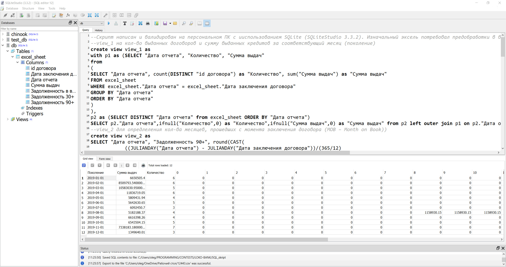

# LokoBank_contest

<!-- #region -->
<p align="center">

</p>

В этом репозитории представлено решение контеста от ЛокоБанк, описание и таблица с данными:
```
Задача.docx, Лист в Задача.xlsx
```

Текст скрипта SQL для задачи 1 (не форматирован), а также винтажная таблица в формате xlsx, созданная с помощью этого скрипта:
```
SQL_skript.txt, Task 1 results.xlsx
```
Скриншот из SQLiteStudio:

<!-- #region -->
<p align="center">

</p>

Решение задачи 2 (расчёт разбит на этапы, для лучшего понимания хода решения):
```
Task 2 results.xlsx
```
